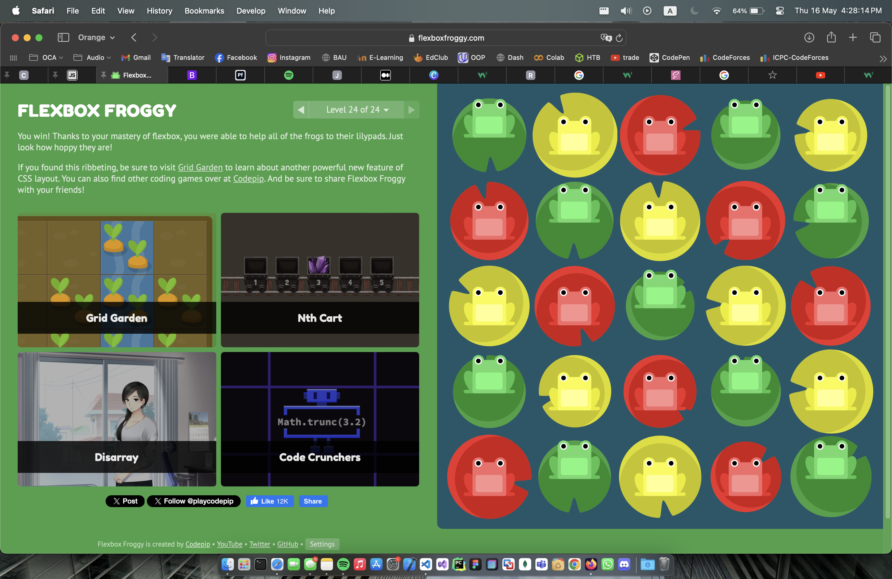

# Grid game:-

# Flex Game:-

# EX1 >> using grid to built a website prototype by sections 

# EX2 >> creating container with users and their photo

# EX3 >> creating a container using flexbox and grid consists of a header, aside,article(with 3 imgs) and a footer
